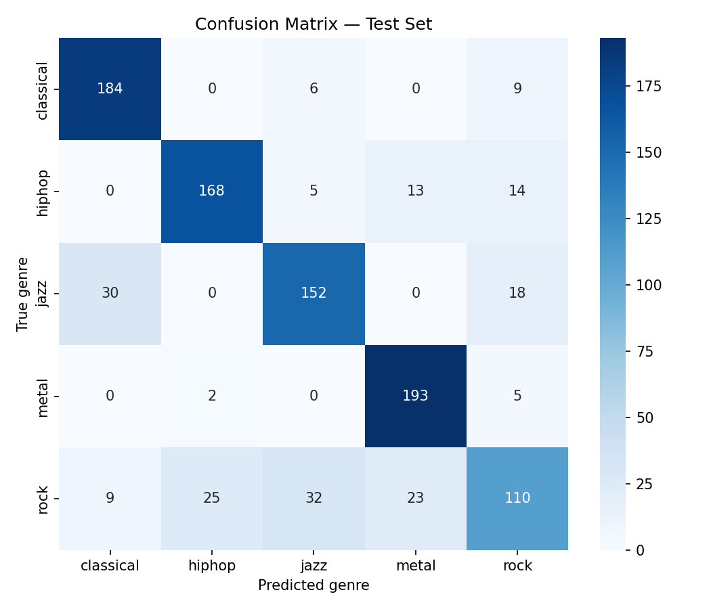

# LSTM Music Genre Classifier

An audio sequence classifier that predicts music genre from a short clip:
**GTZAN audio → MFCC/chroma/spectral features → LSTM → genre prediction**,
with a Streamlit demo for uploading and testing your own clips.

## Results

**80.9% test accuracy** across 5 genres (classical, hiphop, jazz, metal,
rock), evaluated on a held-out set of tracks the model never saw during
training.

| Genre | Precision | Recall | F1 |
|---|---|---|---|
| classical | 0.825 | 0.925 | 0.872 |
| hiphop | 0.862 | 0.840 | 0.851 |
| jazz | 0.779 | 0.760 | 0.770 |
| metal | 0.843 | 0.965 | 0.900 |
| rock | 0.705 | 0.553 | 0.620 |
| **weighted avg** | **0.803** | **0.809** | **0.802** |



**What the errors look like**: metal (96.5% recall) and classical (92.5%
recall) are learned cleanly. Rock is the clear weak point, its errors are
spread fairly evenly across all four other genres (23-32 misclassified
into each) rather than concentrated on one confusable neighbor.Jazz is also a bit 
weaker, with a notable number of jazz
clips (30) predicted as classical plausible, since both lean acoustic
and melodic, with less percussive punch than metal/hiphop/rock for MFCC
features to key off.

Several of the model's mistakes were made with *high* confidence
(0.85-0.96), not just borderline uncertainty, suggesting some segments
genuinely share timbral texture across genres in MFCC-feature space,
rather than the model simply being unsure on hard cases.

## Architecture

```
MFCC + spectral centroid + chroma + spectral contrast  (40 features/timestep)
                        ↓
        3-second segments, 130 timesteps each
                        ↓
              LSTM(64, return_sequences=True)
                        ↓
                   Dropout(0.3)
                        ↓
                    LSTM(32)
                        ↓
              Dense(32, activation="relu")
                        ↓
            Dense(5, activation="softmax")
```

~40K parameters. Each 30-second GTZAN track is split into ten 3-second
segments; the model predicts per segment, and the demo app averages
those predictions into one whole-clip answer.

## Try it

```bash
git clone <this-repo>
cd lstm-genre-classifier
pip install -r requirements.txt
streamlit run app.py
```

Upload a `.wav` clip (at least 3 seconds) and get a genre prediction with
a confidence breakdown across all 5 genres, plus an optional view of the
extracted MFCC for the clip.

## Reproducing the full pipeline from scratch

```bash
python -m src.preprocess   # download GTZAN, extract features, cache to disk
python -m src.split        # track-level train/test split
python -m src.train        # train the LSTM
python -m src.evaluate     # confusion matrix + classification report
streamlit run app.py       # interactive demo
```

Each script is independent and reads/writes cached `.npy` files in
`data/processed/`, so you never need to re-download or re-extract
features on repeated runs.

## Design decisions worth knowing about

**Why segment 30s tracks into 3s chunks**: ~500 tracks is a small dataset
for an LSTM. Segmenting turns it into ~5000 training sequences and keeps
each sequence short enough to train quickly, while still giving the LSTM
a real temporal window to model.

**Why the train/test split happens at the track level, not the segment
level**: naively splitting the ~5000 segments randomly would let
segments from the same song land in both train and test. Since segments
from one track share the same recording, mix, and instrumentation, that
would let the model partly "recognize the song" rather than "recognize
the genre", inflating test accuracy in a way that wouldn't reflect real
generalization. `split.py` splits whole tracks first (80/20, stratified
per genre), then takes each track's segments as a unit, so no track's
audio ever appears in both sets.

**Why LSTM, not CNN**: this is worth being upfront about. LSTMs process
MFCC frames as a sequence, but genre is mostly a *global* timbre/texture
property rather than a strongly sequential one, CNNs on spectrograms
are the more common, usually higher-scoring architecture for this exact
task. This project demonstrates sequence modeling on audio specifically;
a CNN-based version would be a natural next iteration.

**Why WAV only in the demo, not MP3**: MP3 decoding via `librosa`
typically needs `ffmpeg` on PATH, which isn't guaranteed on every
machine. WAV works everywhere through `soundfile` with zero extra setup.

## What I'd improve next

- **CNN on spectrograms**, as noted above  the more standard, usually
  stronger architecture for genre classification specifically.
- **Address the rock weak spot** - likely needs either longer temporal
  context (rock's genre cues may need more than 3s to show up
  consistently) or a feature type more sensitive to rhythm/dynamics than
  MFCC (e.g. tempo/onset strength), rather than more hyperparameter
  tuning, since rock's errors are a data/feature-representation issue,
  not an optimization one, the same architecture and training process
  already learns metal and classical cleanly.
- **Scale to all 10 GTZAN genres** once the 5-genre pipeline's limits are
  well understood, expecting a real accuracy drop as more genres overlap
  acoustically (e.g. disco vs pop vs hiphop).
- **Data augmentation** (pitch shift, time stretch) to partially offset
  GTZAN's small size (100 clips/genre) without needing more source data.

